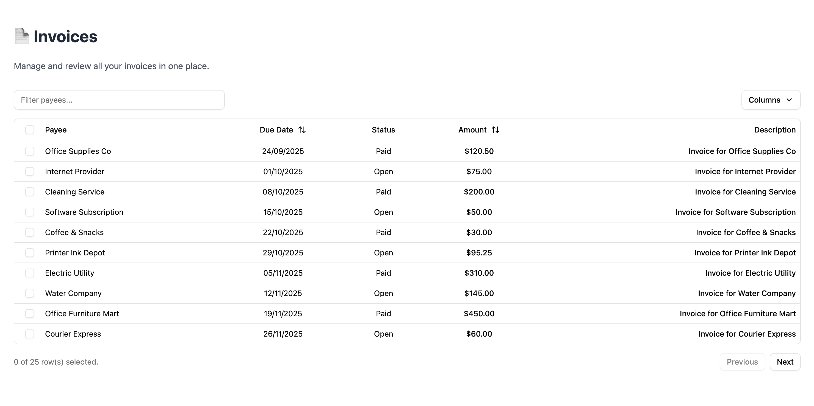

# 🚀 Project Setup Guide

## 🖥️ Server Side

### Requirements

- **Node**: v24.6.0
- **Docker Engine**: v28.3.2
- **Docker Compose**: v2.39.1

### Steps to Run the API Locally

1. **Cd to server directory**

   ```bash
   cd server
   ```

2. **Spin up the Postgres database**

   ```bash
   docker compose up -d
   ```

3. **Install dependencies**

   ```bash
   npm install
   ```

4. **Run migrations:**

   ```bash
   npx prisma migrate dev --name init
   ```

5. **Seed the database** (creates root user + sample invoices)

   ```bash
   npm run db:seed
   ```

6. **Start the API server**

   ```bash
   npm run start
   ```

---

## 🌐 Client Side

### Requirements

- **Node**: v24.6.0
- **pnpm**: v10.16.1

### Steps to Run React Project Locally

1. **Cd to client directory (in a new terminal, keep the api running)**

   ```bash
   cd client
   ```

2. **Install dependencies**

   ```bash
   pnpm install
   ```

3. **Start the project**

   ```bash
   pnpm run dev
   ```

4. **Login credentials**

   ```text
   email:    root@root.com
   password: root123
   ```

# ⚠️ Troubleshooting Potential Login Issues

If you run into issues logging in, try clearing the local storage:

1. Open **Inspect** (right-click → Inspect or press `F12`)
2. Go to the **Application** tab
3. Under **Local Storage**, find and right-click on **http://localhost:5173**
4. Click **Clear**

This should reset any stored session data and allow you to log in again.

# ✨ Project Showcase

## 🔐 Login Page

<div align="center">
  
</div>

## 🧾 Invoices Page

<div align="center">
  
</div>
